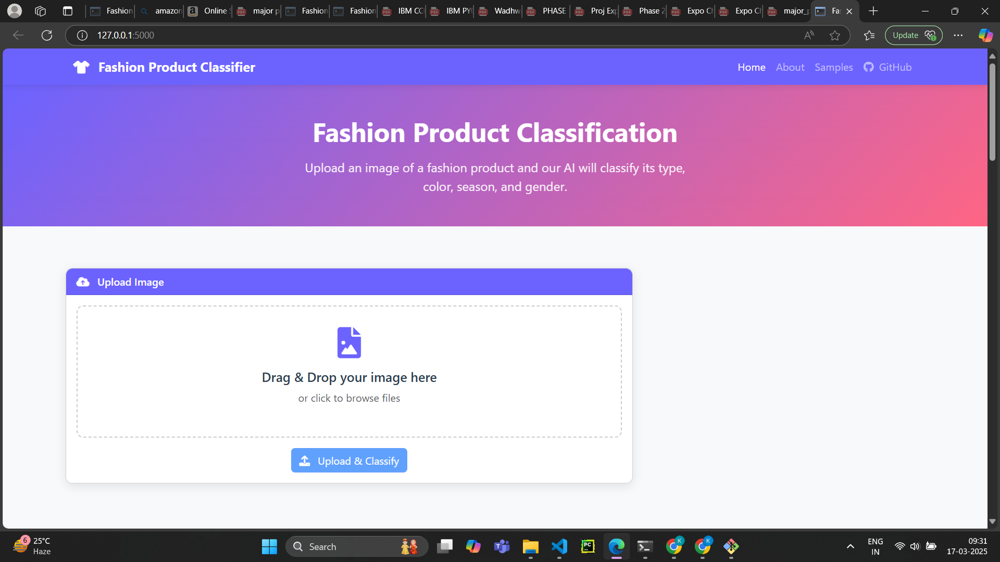
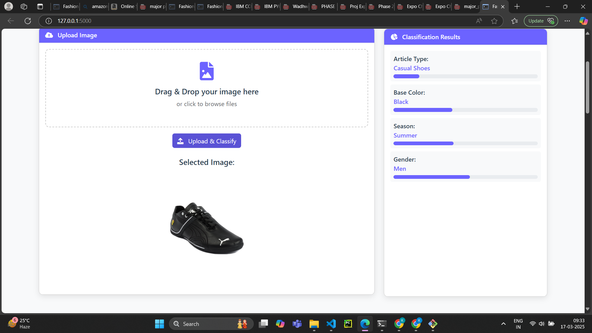
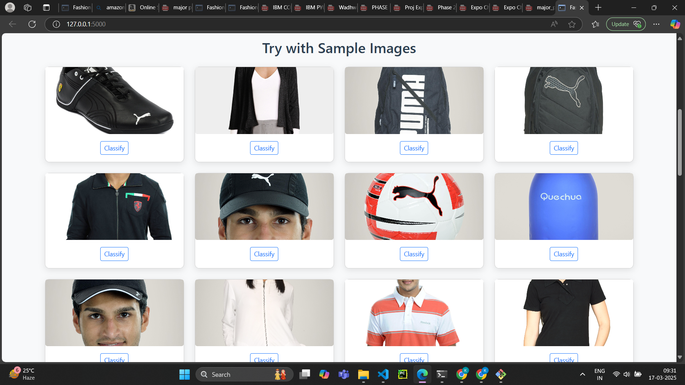

# Fashion Classification Project

Description of the project.

"""
Fashion Product Classification Project Improvement Plan

1. Code Organization and Documentation
   - Add comprehensive docstrings and comments
   - Restructure code into modular components
   - Implement proper logging

2. Enhanced EDA
   - Analyze class distributions and imbalances
   - Explore relationships between features
   - Visualize sample images from different categories
   - Analyze missing values and data quality

3. Improved Model Architecture
   - Implement more advanced architectures (EfficientNet)
   - Add proper regularization techniques
   - Implement learning rate scheduling
   - Add early stopping and model checkpointing

4. Comprehensive Evaluation
   - Implement confusion matrices for each task
   - Calculate precision, recall, and F1 scores
   - Visualize model predictions
   - Implement cross-validation

5. Robust API
   - Add proper error handling
   - Implement request validation
   - Add API documentation with Swagger
   - Implement rate limiting and security features

6. Enhanced UI
   - Create a more responsive and user-friendly interface
   - Add visualization of model confidence
   - Implement drag-and-drop functionality
   - Add sample images for testing
"""


# Fashion Product Classification

# output



# Demo:







## Project Setup

### Prerequisites
- Ensure you have Anaconda installed.
- Install necessary dependencies in a Conda environment.

### Steps to Set Up and Run the Project

#### 1. Navigate to the Project Directory
```sh
cd "C:\Users\Kushal S\Desktop\codemonk2"
```

#### 2. Activate the Conda Environment
```sh
conda activate codemonk
```

#### 3. Open the Project in VS Code
```sh
code .
```

#### 4. Run the Template Script to Set Up the Project
```sh
python template.py
```
**Expected Output:**
```
✅ Directories created successfully.
✅ Created: fashion-classification/templates/index.html
✅ Created: fashion-classification/improved_fashion_classification.py
✅ Created: fashion-classification/improved_app.py
✅ Created: fashion-classification/requirements.txt
✅ Created: fashion-classification/README.md
🎉 Project setup completed!
```
# Fashion Product Classification Project

## Step-by-Step Guide to Run the Fashion Product Classification Project

Follow these detailed instructions to set up and run the improved fashion product classification project from start to finish.

## 1. Environment Setup

First, let's set up a Python environment for the project:

```sh
# Create a new directory for the project
mkdir fashion-classification
cd fashion-classification

# Create a virtual environment
python -m venv venv

# Activate the virtual environment
# On Windows:
venv\Scripts\activate
# On macOS/Linux:
source venv/bin/activate
```

## 2. Install Dependencies

Create a `requirements.txt` file and install the dependencies:

```sh
pip install -r requirements.txt
```

## 3. Project Structure

Create the following directory structure:

```plaintext
fashion-classification/
├── data/                      # Will contain the dataset
├── models/                    # Will store trained models
├── notebooks/                 # For Jupyter notebooks
├── static/                    # Static files for the web app
├── templates/                 # HTML templates
│   └── index.html             # Improved index.html
├── uploads/                   # For uploaded images
├── sample_images/             # Sample images for testing
├── improved_fashion_classification.py  # Main training script
├── improved_app.py            # Flask API
├── requirements.txt           # Dependencies
└── README.md                  # Project documentation
```

Create the necessary directories:

```sh
mkdir -p data/images models notebooks static templates uploads sample_images
```

## 4. Download and Prepare the Dataset

Download the dataset from [Kaggle](https://www.kaggle.com/datasets/paramaggarwal/fashion-product-images-dataset):

```sh
pip install kaggle
kaggle datasets download -d paramaggarwal/fashion-product-images-dataset
unzip fashion-product-images-dataset.zip -d data/
```

## 5. Prepare Sample Images

```sh
cp data/fashion-dataset/images/10001.jpg sample_images/
cp data/fashion-dataset/images/10002.jpg sample_images/
cp data/fashion-dataset/images/10003.jpg sample_images/
cp data/fashion-dataset/images/10004.jpg sample_images/
```

## 6. Save the Improved Code Files

1. Save `improved_fashion_classification.py`
2. Save `improved_app.py`
3. Save `templates/index.html`

## 7. Update File Paths

In `improved_fashion_classification.py`, update:

```python
# Define paths
data_dir = "data/fashion-dataset"
images_dir = os.path.join(data_dir, "images")
styles_file = os.path.join(data_dir, "styles.csv")
```

## 8. Train the Model

```sh
python improved_fashion_classification.py
```

## 9. Run the Flask API

```sh
python improved_app.py
```

## 10. Access the Web Interface

Open: `http://localhost:5000`

## 11. Test with External Images

1. Download fashion product images
2. Upload them via the web interface

## 12. Troubleshooting

### Model Training Issues:
- Ensure enough disk space
- Reduce batch size if memory issues occur

### Flask API Issues:
- Check model paths
- Ensure required directories exist

### Web Interface Issues:
- Clear browser cache
- Check template file paths

## 13. Optional: Deploy to Production

```sh
pip install gunicorn
gunicorn -w 4 -b 0.0.0.0:5000 improved_app:app
```

To use Docker:

```sh
docker build -t fashion-classification .
docker run -p 5000:5000 fashion-classification
```

## 14. Project Enhancements

1. **Improve Model Performance**:
   - Fine-tune hyperparameters
   - Try different architectures
   - Implement advanced data augmentation

2. **Expand Web Features**:
   - User authentication
   - History of classifications

3. **Enhance API**:
   - Batch processing
   - Authentication

## Summary

This project provides:
- A well-structured ML pipeline
- A deep learning model for classification
- A robust Flask API
- A user-friendly web interface